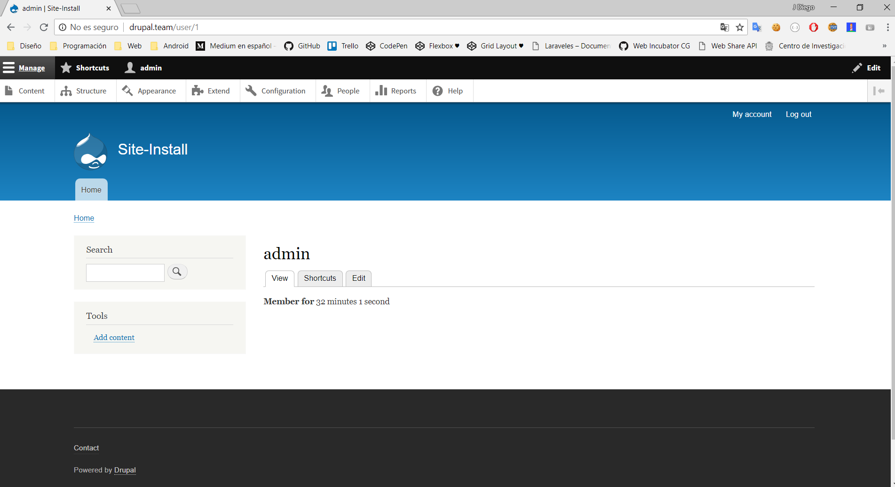

- [Clase 2](#clase-2)
  - [Dashboard y Toolbar](#dashboard-y-toolbar)

# Clase 2

## Dashboard y Toolbar

* **Manage**: Diferentes configuraciones
  * Content: Drupal nos da por defecto dos tipos de contenidos: `article` and `basic page` que nos ayudaría a tener un blog, para una web real estos tipos de contenidos no son suficientes
    * Para crear un tipo de contenido accedemos a Structure->Content Types
  * Structure
    * Block Layout
    * 
    * 
    * Content Types: es un listado de tipos de contenido, podemos agregar un tipo de contentido, `revision:` Una revision en drupal es un historico como en git para jugar en el tiempo
    * Taxonomy: Taxonomia-> Nos permite categorizar contenido, etiquetarlos, ejemplo categorizar productos, nos ayudan los vocabularios `productos`,  `países`, drupal nos da por default `tags`
  * Appearence
  * Extend
  * Configuration
  * People
  * Reports: Para ver actualizaciones, configuraciones para elegir la verificación de actualizaciones este nos puede avisar via notificación email
    * actualizaciones
    * mensajes recientes, logs, como inicios de sesión, inicios incorrectos de sesión y asi más...como , accesos indebidos a algunas rutas
    * field list: listado de campos `http://drupal.team/admin/reports/status` Nos da un error trusted_host_patterns que nos dice que nuestro sitio puede ser clonado pero se soluciona en producción,  Un warning de cacheo, que en desarrollo no es recomendable ni necesario...y lo demas todo bien a menos que tengas algún error...
    * Top de accesos denegados en las rutas
    * Top de páginas no encontradas
    * Top de la caja de búsqueda.. que es lo que mas buscan
    * views plugin... se tocará en el tema de vistas
    * TENER MUY EN CUENTA LA SECCIÓN DE `REPORTS`
  * Help
* **Shorcuts**: Atajos
* **admin**: Info del que hizo el login