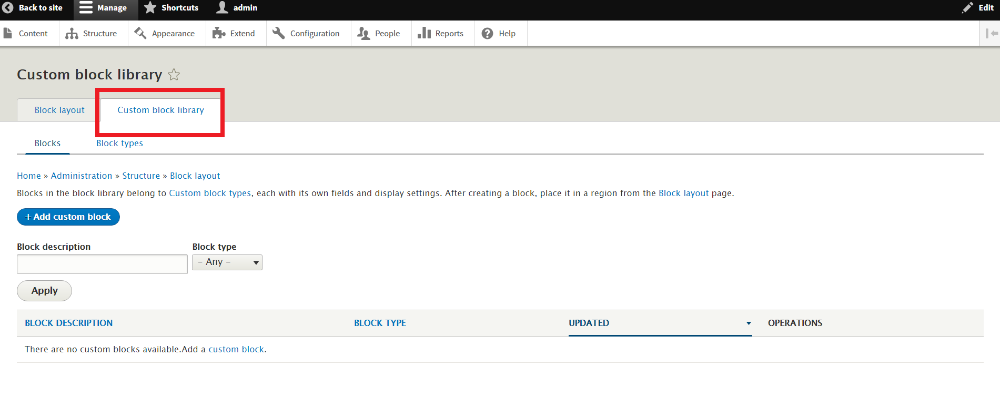

- [Block Layout](#block-layout)
  - [Diferencias entre regiones y bloques](#diferencias-entre-regiones-y-bloques)
    - [regiones](#regiones)
    - [bloques](#bloques)
  - [Modificar bloques y regiones](#modificar-bloques-y-regiones)
  - [Crear Bloques](#crear-bloques)
  - [Visibilidad de los bloques](#visibilidad-de-los-bloques)
  - [Menús](#men%C3%BAs)
  - [Manejo de Usuarios](#manejo-de-usuarios)
    - [Permisos y Roles de los usuarios](#permisos-y-roles-de-los-usuarios)
      - [Permisos](#permisos)
      - [Roles](#roles)
    - [Crear un nuevo usuario](#crear-un-nuevo-usuario)
  - [Modulos en Wordpress](#modulos-en-wordpress)
    - [Admin Toolbar](#admin-toolbar)
    - [Video](#video)

# Block Layout

Dentro de `Structure>Block Layout` ingresamos a `Demonstrate block regions (Bartik)` que nos mostrará los bloques y regiones y nos aparecera algo como:

## Diferencias entre regiones y bloques

### regiones

* Son los cuadros amarillos
* Es un breve espacio de nuestro documento donde nosotros podemos ubicar diferente tipo de informacion.
* lugares donde se ponen un bloque

### bloques

Es un bloque de info que se encuentra en una region

## Modificar bloques y regiones

Tambien podemos modificar los bloques desde la vista, previo inicio de sesión por supuesto...

## Crear Bloques

Para crear bloques ingresamos a la sección `structure>Block Layout`

Una vez adentro para crear damos click en el boton de `add`

Para agregar ese bloque nos dirigimos a la seccion de configurar bloques...y le damos en `place block` que es colocar bloque...

> Cabe mencionar que tambien podemos crear un bloque desde place block...

## Visibilidad de los bloques

Para configurar la visibilidad de los bloques accedemos al lápiz editar y despues de eso configuramos a nuestra conveniencia modificamos las opciones:

Por ejemplo para ocultar el bloque en todas las páginas configuramos:

## Menús

En drupal cada menú esun bloque...

Para acceder a la configuracion accedemos a: `http://localhost/admin/structure/menu` que sería `structure>menu`

Para crear menú por ejemplo para nuestras redes sociales...

y en la parte inferior vemos los distintos menús que nos vienen por defecto, podemos editarlos y agregar nuestros enlaces personalizados.

## Manejo de Usuarios

Nos dirigimos a la pestaña `manage>people` o accediendo a `http://localhost/admin/people`

Drupal por defecto nos ofrece acceder al sitio de manera segura, ademas de un super usuario que controla todo... este no se podrá eliminar ademas que no es recomendable hacerlo.

Drupal nos permite crear 3 tipos de usuarios:
* **anonimos**: Son los que visitan nuestro sitio y no tienen una cuenta de usuario. Estos pueden acceder a todas las vistas autorizazadas de nuestro sitio
* **registrados o autenticado**: Este solo hace las cosas que nosotros le digamos
* **administradores**: Estos usuarios tienen acceso total al sitio web, hace y deshace.

Hay problemas de seguridad solo por la mala configuración de estos usuarios o permisos, si uno por error a un usuario anonimo le da permisos este malogrará nuestro contenido, y tambien puede que pase por darle permisos a nuestros usuarios registrados, asi es que mucho cuidado a quien se da permisos.

### Permisos y Roles de los usuarios

#### Permisos

Aquí se pueden configurar cosas de permisos globales como:

* Administrar Bloques, configurarlos moverlos, ocultarlos
* Administrar la seccion de comentarios
* postear comentarios
* configuracion del sitio
* administrar formularios de contacto
* y asi son muchos más, poco a poco te iras dando cuenta de todo esto con la práctica

> Tener muy en cuenta de que tenemos que tener mucho cuidado al dar permisos a nuestros usuarios

#### Roles

Por defecto drupal nos da tres tipos de usuarios, pero nosotros podemos agregar otros tipos de usuario, y a este podemos darle diferentes tipos de permisos desde cero, bueno no tan desde cero porque este usuario es autenticado y hereda por lo tando de este algunos permisos.

Para crear un nuevo role nos dirigimos a `http://drupal.team/admin/people/roles` y clickamos en `+ add role` una vez creado en permisos nos aparecera una columna con el nombre del role y ahi podemos añadir nuevos permisos a este role.

### Crear un nuevo usuario

Nos dirigimos a: `http://drupal.team/user/login` y nos dirigimos a la pestaña `create new account`  y lo rellenamos todo lo que nos pide y seleccionamos el role que queramos.

## Modulos en Wordpress

Cada modulo es una funcionalidad diferente. y podemos descargarlos desde la página oficial  `drupal.org/project/modules` y nos redirigira a `drupal.org/project/project_module`

Podemos encontrar modulos como por ejemplo para:
* mejorar interfaz
* mejorar experiencia de usuario
* redes sociales
* carruseles
* formularios avanzados
* SEO
* y más

Ejemplos

### Admin Toolbar

[admin toolbar](https://www.drupal.org/project/admin_toolbar)

Nos permite dar un efecto hover a nuestro menú toolbar.

El botón de descarga se encuentra en la parte inferior, podemos descargar `tar.gz` o e `zip` Simplemente damos click a cualquiera y se nos descargará...

Lo que tenemos que hacer es acceder a nuestro proyecto y dirigirnos a la ruta `./modules/` en este solo se encuentra un README.txt lo que tenemos que hacer es crear una carpeta `contrib` que es un estandar en drupal y dentro de esta carpeta podemos poner todos nuestros `modules` ya que estos son contribuidos.

y ahora descomprimimos nuestros modules en esa carpeta `contrib`.

Ahora vamos a nuestro toolbar y nos dirigimos a nuestra pestaña `Extend` que sera donde nos mostrarán todos nuestros modulos, algunos de fábrica y otros que nosotros instalemos como el `admin_toolbar` seleccionamos el modulo y damos en instalar y con eso ya estaremos usando el modulo :).

### Video

[Video](https://www.drupal.org/project/video)

Nos ayuda para crear campos de tipo video, ya que este no existe en las opciones por defecto de drupal para los campos.

Ahora otra forma de instalación de un modulo es usando `drush` :) con el comando `drush dl video`, la condicion es estar dentro del proyecto en consola, no importa donde :)

Ahora solo queda instalarlo pero para eso tambien tenemos un comando en drush `drush en video -y` y listo ya tendremos a nuestra disposición el campo video :)